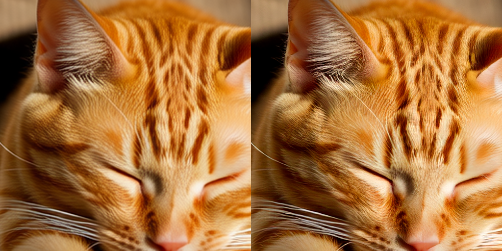
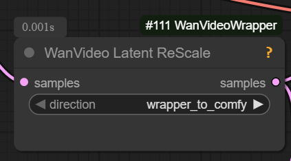

Nodes for loading and using VAEs in ways not supported by base ComfyUI. Currently supports Wan upscale VAE, more may be added later as needed.

## Install

```
cd custom_nodes
git clone https://github.com/spacepxl/ComfyUI-VAE-Utils
```

That's it! No extra requirements outside of what ComfyUI already uses.

## Models

[Wan2.1 VAE 2x imageonly real v1](https://huggingface.co/spacepxl/Wan2.1-VAE-upscale2x/blob/main/Wan2.1_VAE_upscale2x_imageonly_real_v1.safetensors)

## Nodes

### Load VAE (VAE Utils)

Direct replacement for native Load VAE node, but with added input/output channel detection for Wan2.1 VAE

### VAE Decode (VAE Utils)

Decode latents with optional auto detected upscaling, and optional tiling

### Latent Upscale (VAE Utils)


Simple neural latent upscaler (right), far from optimal but much better than naive bilinear/bislerp interpolation (left).

Currently supported: Wan2.1 2x

## Workflows

[workflow/workflow_wan_t2i_upscale2x.png](https://github.com/spacepxl/ComfyUI-VAE-Utils/blob/main/workflow/workflow_wan_t2i_upscale2x.png)

## IMPORTANT

To use native VAE decoding with latents from kijai/ComfyUI-WanVideoWrapper, you need to un-normalize the latents first using this node:


